# Digital Journey

## Overview

Many people want to record and reflect on their daily activities and experiences. Traditional journaling is a common method for this purpose. However, maintaining a journal regularly can be time-consuming and requires consistent manual input.

The goal of this project is to automate journaling by implementing an Android application, mainly through the use of multiple APIs available on the device. The application will stay active even when it is not open, and log information about the user's day, such as location, photos taken, calls made, the weather, music played, calendar events, while also allowing users to manually add journal entries. All collected data will be saved locally on the device and presented in an interactive format, with map, search, and filtering available. The application was developed in Kotlin using Android Studio.

The project was developed as part of a bachelor thesis and focuses on local data processing, privacy-conscious storage, and intuitive timeline navigation.

---

## Main Features

* Unified daily timeline of digital activity
* Collection of:

  * Location points
  * Weather information
  * Call logs
  * Photos and videos
  * Google Calendar events
  * Spotify listening activity
  * Chess games played on chess.com
  * Manual journal entries
  
* Search functionality across stored logs
* Date navigation by day with filtering available
* Month view with interactive log-based view
* Map view using Google Maps API
* Local database storage using Room
* Background synchronization using WorkManager
* Smooth screen navigation with animated transitions
* Daily notifications
* Dark mode support

---

## Technologies Used

* Kotlin
* Jetpack Compose
* Room Database
* WorkManager
* Android Permissions API
* SharedPreferences
* Navigation Compose
* Material Design 3
* Google Maps SDK
* REST APIs

---

## Application Architecture

The project follows a repository-based structure:

* **UI Layer**: 
  Built with Jetpack Compose screens and navigation.

* **Data Layer**:
  Repository classes handle data access from Android system providers.

* **Persistence Layer**:
  Room database stores collected logs locally on the device.

* **Background Processing**:
  WorkManager periodically collects new records.

---

## Data Sources

The application accesses selected Android system content providers and APIs:

* Location Services
* OpenWeather API
* Call log provider
* MediaStore for photos and videos
* Spotify API
* Google Calendar API
* Chess.com API

Permissions are explicitly requested from the user before access, and signing in to external services is not mandatory for the core functionality of the app.

---

## Privacy

All collected data is stored locally on the device.

External communication is required only for optional third-party services such as weather and account synchronization APIs.

No collected personal data is uploaded to external servers by the application itself.

---

## Installation

1. Clone the repository:

```bash
git clone <repository-url>
```

2. Open the project in Android Studio.

3. Sync Gradle dependencies.

4. Connect an Android device or emulator.

5. Run the application.

---

## Requirements

* Android Studio (latest stable version recommended)
* Android SDK
* Minimum Android version: 8.0

---

## Set-up

1. Launch the application.
2. Grant required permissions
   * Location (Allow all the time)
   * Contacts
   * Call logs
   * Photos and videos
   * Notifications
  
3. In settings, if the user has an account for the service, sign in to
   * Spotify
   * Google (for calendar sync)
   * Chess.com
  
4. Set dark mode on, if it is more convenient

---

## Usage

After the set-up, the application will run in the background regardless of being open. It will silently log all enabled categories and store everything in the local database. The user can later browse stored logs and review past activities over time.
### Day screen

This screen displays all logs recorded on a selected day. Each entry displays a timestamp, category icon (emoji), and log content consisting mainly of primary and secondary information. In the bottom-right corner, we can hit the refresh button to get the newest logs (although they refresh every time the screen is opened) and a Filter button, which allows filtering logs by category we want to see in the list. At the top, we can choose which day to examine, and also to switch to Map view. In Map view, all the locations logged for the selected day are shown as pins on the map, and after clicking a pin, logs recorded at that location are displayed.

<p align="center"> 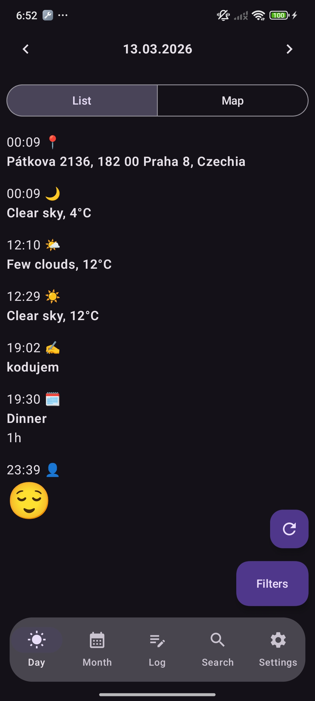 &nbsp;&nbsp;&nbsp; 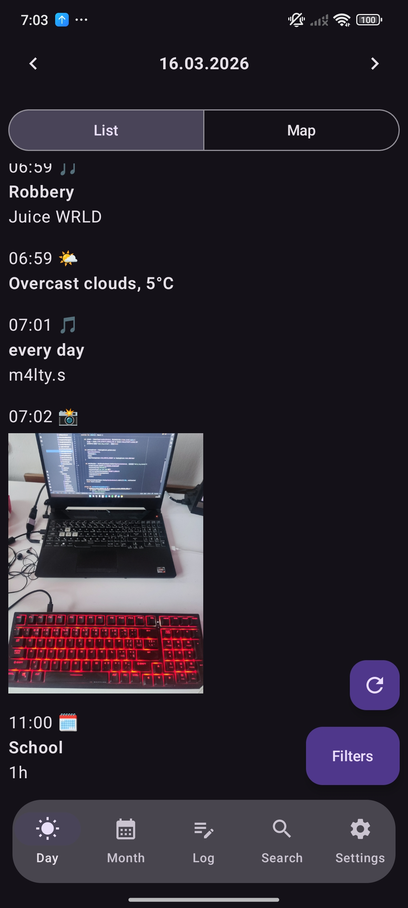 &nbsp;&nbsp;&nbsp; 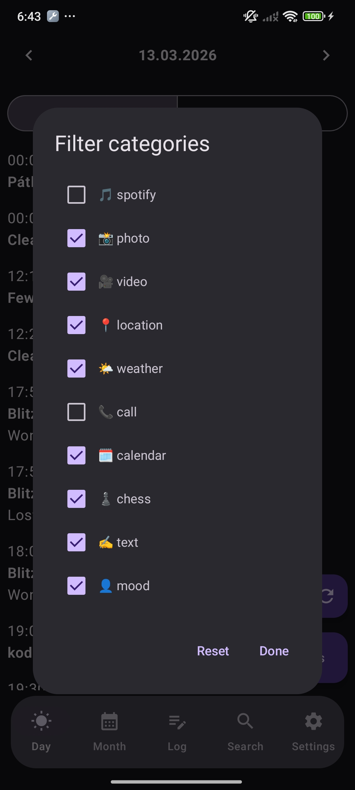 </p>

<p align="center"> 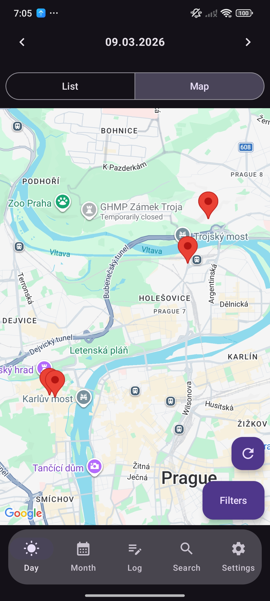 &nbsp;&nbsp;&nbsp; 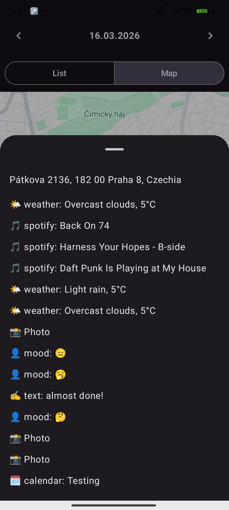 </p>


### Month screen

In the Month screen, we can browse months, like in a calendar, and selecting a day opens the Day screen for that date. The filter dropdown allows us to choose a category to examine, and the calendar days' colors will change depending on the number of logs for that day. This allows us to see which days we had the most activity. The Today and This month buttons are used to quickly get back to the present.

<p align="center"> 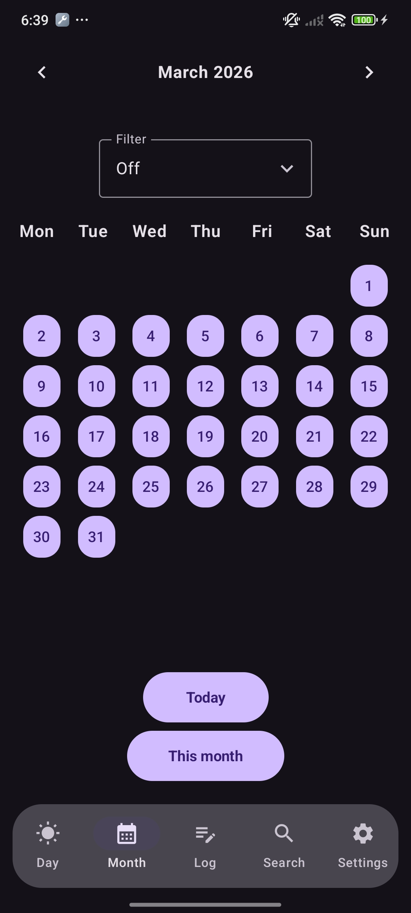 &nbsp;&nbsp;&nbsp; 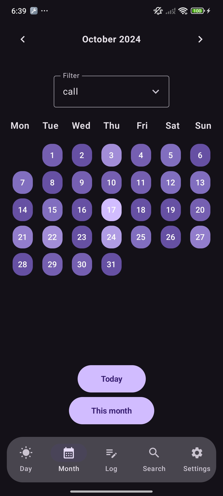 </p>

### Log screen

Here we can log two types of information - the mood (represented by the emojis, split into the good ones and the bad ones) and text (like a normal journal). Neither entry type is editable or deletable by design, with the intention of capturing the moment without the ability to edit it afterward.

<p align="center"> 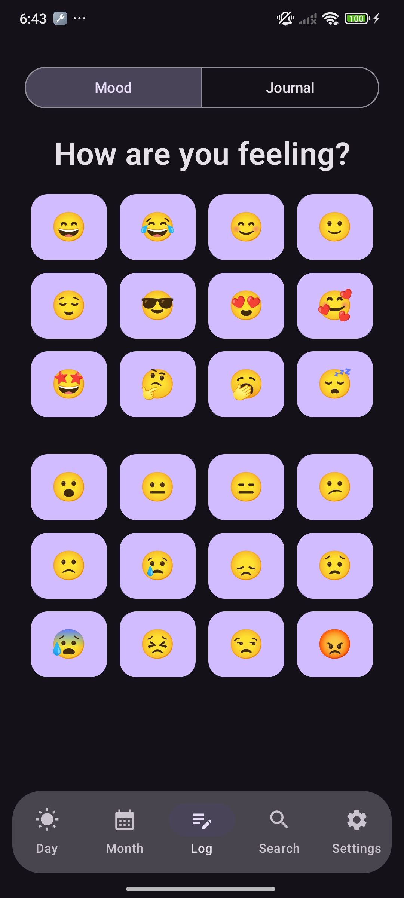 &nbsp;&nbsp;&nbsp; 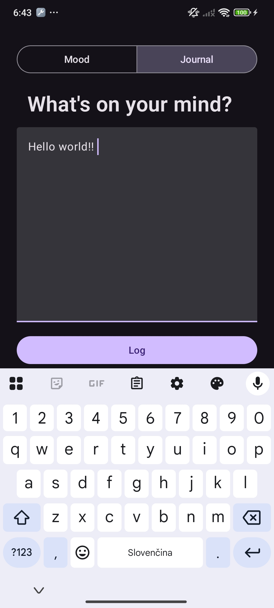 </p>

### Search screen

The search screen consists of text input and the Search button. After searching for a keyword (it can be the type, or any word or any partial word of any log), we see a list of logs found in the entire database, sorted from the most recent. After clicking a result, we get taken to the Day screen of the log's day and the log gets highlighted.

<p align="center"> 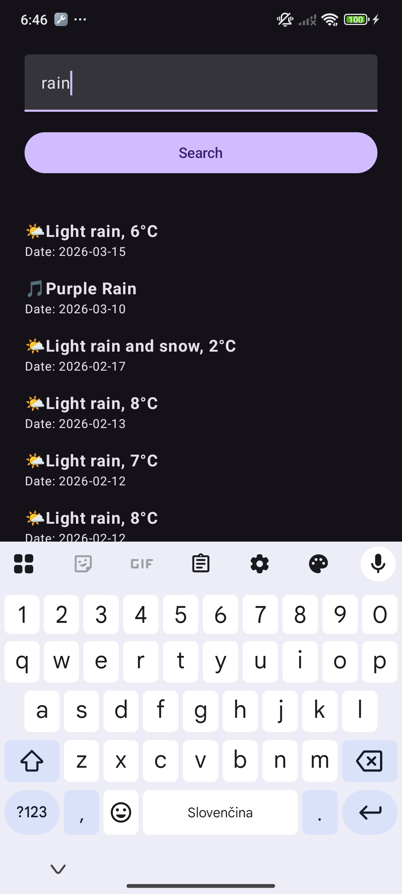

### Settings screen

Here we log in to external services and set the Dark Mode and Notifications (daily notifications to log your mood which opens the Log screen) on/off.

<p align="center"> 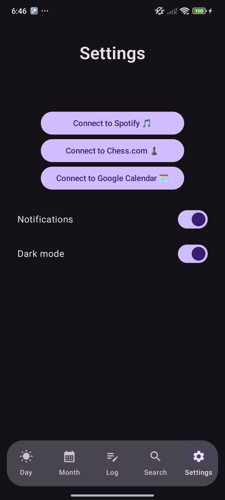

## Project Structure

```text
app/
 ├── data/        # repositories, managers
 ├── model/       # business logic, database setup
 ├── ui/          # compose screens and navigation
 ├── theme/       # visual styling
```

---

## Future Improvements

* Data export functionality
* Cloud backup support
* Advanced filtering
* Statistics and visual analytics
* Database encryption

---

## Notes for testing

* In order to test the Google sign-in to sync Google Calendar, the tester needs to contact me to be added to the Audience test user list. Contact: adamposa123@gmail.com
* The application has currently only been tested on a Xiaomi device. It is possible some issues may occur on other devices, specifically around some permissions. 

